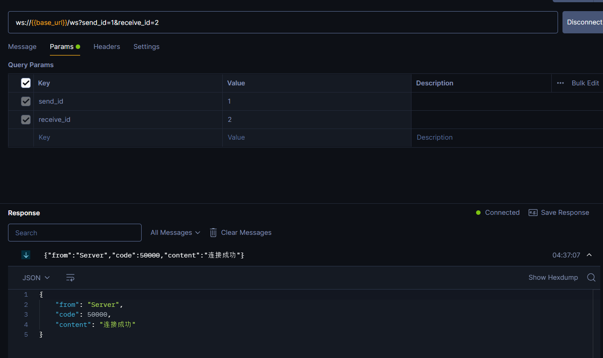
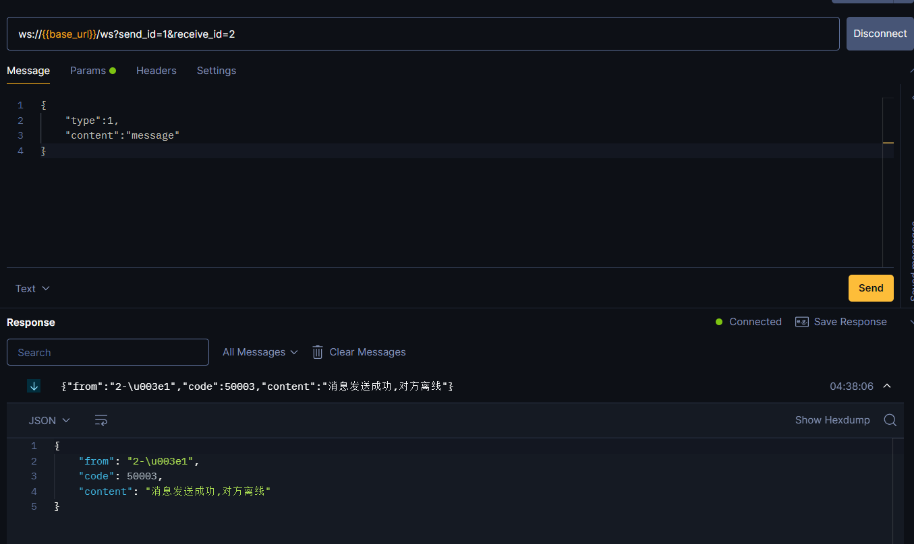
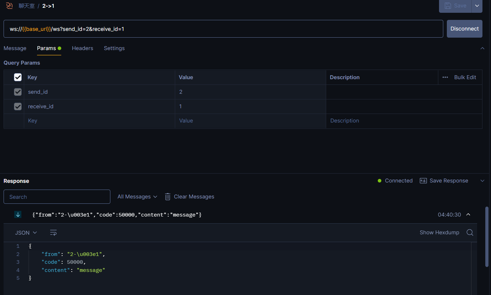

# Project Name
Gin_Websocket_Chat
[中文版](./README_zh.md)
## Project Overview
This is an online chat backend system based on the Gin framework, Gorm ORM, MySQL database, and WebSocket technology. The system supports real-time chat for users, providing stable and efficient message transmission services, suitable for various online chat applications.
The project is based on [gin-chat-demo](https://github.com/CocaineCong/gin-chat-demo) and has been modified.

## Features
- **User Management**: User registration, login, and authentication features
- **Real-time Chat**: Real-time message transmission based on WebSocket
- **Message Storage**: Persistent chat records using MySQL database
- **High Scalability**: Modular design for easy feature expansion and maintenance

## Tech Stack
- [**Gin**](https://gin-gonic.com/): A web framework written in Go (Golang)
- [**Gorm**](https://gorm.io/index.html): An ORM library for Go
- [**MySQL**](https://www.mysql.com/): Relational database management system
- [**WebSocket**](https://github.com/gorilla/websocket): Protocol for real-time communication

## Project Configuration File
The project configuration file is located in `config.json`, containing MySQL database connection information and other settings. If you need to modify the configuration, please edit this file.
Configuration file structure:
```json
{
  "mysql": {
    "host": "127.0.0.1",
    "port": 3306,
    "user": "admin",
    "password": "admin",
    "dbname": "message_history"
  },
  "server": {
    "address": "127.0.0.1",
    "port": 8080
  }
}
```

## Project Structure
``` 
.
├── LICENSE
├── README.md
├── README_zh.md
├── code
│   └── code.go
├── config
│   └── config.go
├── config.json
├── go.mod
├── go.sum
├── internal
│   ├── controller
│   │   └── websocket.go
│   ├── dao
│   │   └── MySQL.go
│   └── service
│       ├── createID.go
│       └── websocket.go
├── main.go
├── model
│   ├── Message.go
│   └── model.go
├── pkg
│   └── MySQL
│       └── MySQL.go
└── route
    └── route.go
```

## Running the Project
```shell
go run main.go
```

## Status Codes
### Status Code Table

| Status Code                | Value  | Description          |
|----------------------------|--------|----------------------|
| WebsocketSuccess           | 50000  | WebSocket success    |
| WebsocketEnd               | 50001  | WebSocket end        |
| WebsocketOnlineReply       | 50002  | WebSocket online reply |
| WebsocketOfflineReply      | 50003  | WebSocket offline reply |
| WebsocketLimit             | 50004  | WebSocket limit      |

## How to Use the Project
The project runs on port 8080 by default, which can be modified in the `config.json` file.
We use [Postman](https://www.postman.com/) as an example to test the application.
After running the project, use Postman to send a WebSocket request:

You can see the returned information, where `code` is the status code, and `50000` indicates a successful WebSocket connection.

Then send a message:
Message format:
```json
{
  "type": 1, // The format of the message to send, must be a number
  "content": "message content"
}
```


If User 1 sends a message after User 2 comes online, User 2 will receive the message.


## Types of Messages to Send:
### 1
```json
{
  "type": 1,
  "content": "message"
}
```
Same as above, indicates sending a message, where `content` is the content of the message to send.

### 2
```json
{
  "type": 2
}
```
Indicates viewing all chat records between two users, which will return all chat records in chronological order. The return format is:
```json
{
  "from": "1",
  "code": 50000,
  "content": [
    {
      "ID": 13,
      "CreatedAt": "2024-07-07T04:40:31.012+08:00",
      "UpdatedAt": "2024-07-07T04:40:31.012+08:00",
      "DeletedAt": null,
      "send_id": "1",
      "receive_id": "2",
      "content": "message",
      "is_read": true
    },
    {
      "ID": 12,
      "CreatedAt": "2024-07-07T04:40:00.917+08:00",
      "UpdatedAt": "2024-07-07T04:40:00.917+08:00",
      "DeletedAt": null,
      "send_id": "1",
      "receive_id": "2",
      "content": "message",
      "is_read": false
    },
    {
      "ID": 11,
      "CreatedAt": "2024-07-07T04:39:54.625+08:00",
      "UpdatedAt": "2024-07-07T04:39:54.625+08:00",
      "DeletedAt": null,
      "send_id": "1",
      "receive_id": "2",
      "content": "message",
      "is_read": false
    }
  ]
}
```

### 3
```json
{
  "type": 3
}
```
Indicates viewing all unread messages sent to oneself by the other party.

### 4
```json
{
  "type": 4
}
```
Indicates viewing all of one's own unread messages. The format is as follows:
```json
{
    "total_counts": 16,
    "unread_counts": [
        {
            "send_id": "1",
            "unread_count": 5
        },
        {
            "send_id": "3",
            "unread_count": 5
        },
        {
            "send_id": "5",
            "unread_count": 6
        }
    ]
}
```

Feel free to make further adjustments or let me know if there's anything else you need.