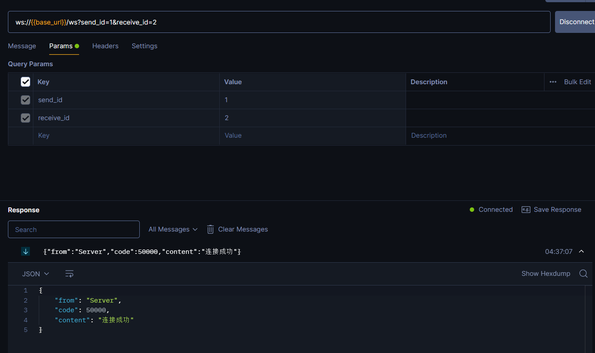
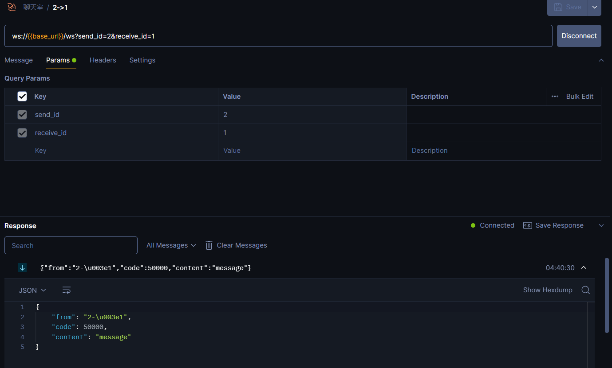

# 项目名称
Gin_Websocket_Chat
[English Version](./README.md)

## 项目概述
这是一个基于Gin框架、Gorm ORM、MySQL数据库和WebSocket技术的在线聊天后端系统。该系统支持用户实时聊天，提供稳定、高效的消息传输服务，适合用于各种在线聊天应用。
项目参考了[gin-chat-demo](https://github.com/CocaineCong/gin-chat-demo)项目,并进行了修改

## 功能特点
- **用户管理**：用户注册、登录和认证功能
- **实时聊天**：基于WebSocket的实时消息传输
- **消息存储**：使用MySQL数据库持久化聊天记录
- **高扩展性**：模块化设计，方便功能扩展和维护

## 技术栈
- [**Gin**](https://gin-gonic.com/)：一个用Go (Golang) 编写的Web框架
- [**Gorm**](https://gorm.io/index.html)：一个用于Go语言的ORM库
- [**MySQL**](https://www.mysql.com/)：关系型数据库管理系统
- [**WebSocket**](https://github.com/gorilla/websocket)：用于实时通信的协议

## 项目配置文件
项目配置文件位于`config.json`文件中，包含了MySQL数据库的连接信息等其他信息，如需修改数请修改该文件。
配置文件结构:
```json
{
  "mysql": {
    "host": "127.0.0.1",
    "port": 3306,
    "user": "admin",
    "password": "admin",
    "dbname": "message_history"
  },
  "server": {
    "address": "127.0.0.1",
    "port": 8080
  }
}

```

## 项目结构
``` 
.
├── LICENSE
├── README.md
├── README_zh.md
├── code
│   └── code.go
├── config
│   └── config.go
├── config.json
├── go.mod
├── go.sum
├── internal
│   ├── controller
│   │   └── websocket.go
│   ├── dao
│   │   └── MySQL.go
│   └── service
│       ├── createID.go
│       └── websocket.go
├── main.go
├── model
│   ├── Message.go
│   └── model.go
├── pkg
│   └── MySQL
│       └── MySQL.go
└── route
    └── route.go
```

## 项目运行
```shell
go run main.go
```

## 状态码
# 状态码表

| 状态码                     | 值     | 描述                  |
|--------------------------|-------|-----------------------|
| WebsocketSuccess         | 50000 | WebSocket 成功         |
| WebsocketEnd             | 50001 | WebSocket 结束         |
| WebsocketOnlineReply     | 50002 | WebSocket 在线回复      |
| WebsocketOfflineReply    | 50003 | WebSocket 离线回复      |
| WebsocketLimit           | 50004 | WebSocket 限制         |


## 项目使用方式:
项目默认运行在本地的8080端口,可以在`config.json`文件中修改
我们以[Postman](https://www.postman.com/)为例,使用Postman进行测试
在项目运行后使用Postman发送websocket请求

可以看到返回的信息,其中`code`为状态码,为50000,表示websocket成功连接

然后发送信息
发送信息的格式:
```json
{
  "type": 发送的信息的格式,需要为数字,
  "content": 发送的信息的内容,
}
```


如果1在2上线后发送信息,则2会收到信息


## 发送的信息的类型:
### 1
```json
{
  "type": 1,
  "content": "message"
}
```
同上,表示发送信息,其中`content`为发送的信息的内容

### 2
```json
{
  "type": 2
}
```
表示查看两个用户之间的所有聊天记录,会按照时间顺序返回所有的聊天记录,返回的信息格式为:
```json
{
  "from": "1",
  "code": 50000,
  "content": [
    {
      "ID": 13,
      "CreatedAt": "2024-07-07T04:40:31.012+08:00",
      "UpdatedAt": "2024-07-07T04:40:31.012+08:00",
      "DeletedAt": null,
      "send_id": "1",
      "receive_id": "2",
      "content": "message",
      "is_read": true
    },
    {
      "ID": 12,
      "CreatedAt": "2024-07-07T04:40:00.917+08:00",
      "UpdatedAt": "2024-07-07T04:40:00.917+08:00",
      "DeletedAt": null,
      "send_id": "1",
      "receive_id": "2",
      "content": "message",
      "is_read": false
    },
    {
      "ID": 11,
      "CreatedAt": "2024-07-07T04:39:54.625+08:00",
      "UpdatedAt": "2024-07-07T04:39:54.625+08:00",
      "DeletedAt": null,
      "send_id": "1",
      "receive_id": "2",
      "content": "message",
      "is_read": false
    }
  ]
}
```

### 3
```json
{
  "type": 3
}
```
表示查看对方发给自己的所有的未读消息

### 4
```json
{
  "type": 4
}
```
表示查看自己的所有的未读消息,格式如下:
```json
{
    "total_counts": 16,
    "unread_counts": [
        {
            "send_id": "1",
            "unread_count": 5
        },
        {
            "send_id": "3",
            "unread_count": 5
        },
        {
            "send_id": "5",
            "unread_count": 6
        }
    ]
}
```
